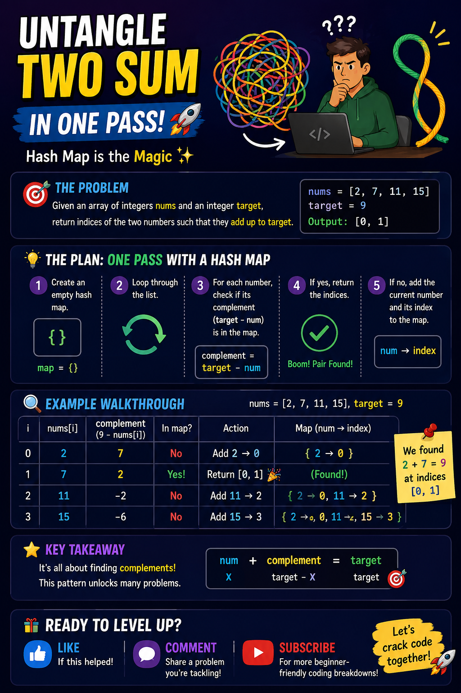

# CreativeFlow AI

> An AI-powered creative partner that transforms a raw idea into a complete content package — and helps you improve it through iterative AI mentorship.

Built for the **IBM AI Builders Challenge — July 2025: Reimagine Creative Industries with AI**.

---

## The Problem

Content creators spend hours turning a single idea into a script, storyboard, and publishable assets. Most lack access to expert creative feedback. The result: slow production cycles, inconsistent quality, and creative burnout.

## The Solution

CreativeFlow AI compresses a multi-hour creative workflow into minutes. Enter a topic, audience, and platform — the AI generates a full creative package and then acts as your personal creative director, scoring your work and suggesting specific improvements. Every section can be refined with a plain-English instruction, keeping the human in control at every step.

```
Raw Idea
   │
   ▼
Creative Brief   →  AI structures your thinking
   │
   ▼
Script           →  AI writes it, you refine it
   │
   ▼
Storyboard       →  AI plans the visuals
   │
   ▼
Visual Prompts   →  AI generates image prompts for ChatGPT / Midjourney
   │
   ▼
Mentor Review    →  AI scores and coaches you to improve
```

---

## Demo

This is a real end-to-end example of CreativeFlow AI in action.

**Step 1 — Input a topic:**

| Field | Value |
|---|---|
| Topic | Two Sum Problem explained with Hash Maps |
| Audience | Beginner |
| Platform | YouTube |
| Goal | Educate |

**Step 2 — CreativeFlow AI generates a complete script:**

```
HOOK
Ever stared at a coding problem and felt like you're untangling a messy ball of yarn?
Let's untangle the Two Sum problem together and make it crystal clear!

SCRIPT
Alright, let's dive into the Two Sum challenge! Imagine you've got a list of numbers
and you need to find two that add up to a specific target. Sounds tricky, right?
But here's the magic: you can solve it in just one pass using a hash map!

First, create an empty hash map. Then, loop through your list. For each number,
check if its complement (target minus the current number) is already in the map.
If it is — boom! You've found your pair. If not, add the current number and keep going.

It's all about finding complements. Once you see this pattern, Two Sum and similar
challenges will feel like a walk in the park. You've got this!

CALL TO ACTION
Hit the like button, drop a comment with a problem you're tackling, and subscribe
for more beginner-friendly coding breakdowns! Let's crack code together!
```

**Step 3 — Creator copies the script and pastes it into ChatGPT image generation.**

**Step 4 — The result:**



> This infographic was created by pasting the CreativeFlow AI-generated script directly into ChatGPT. No manual writing. No design brief. Just a topic in, and a publishable visual asset out.

---

## Features

| Feature | Description |
|---|---|
| **Creative Brief** | AI generates a title, core message, hook idea, tone, and key takeaway |
| **Script** | Full short-form script with hook, body, and call to action — copyable in one click |
| **Storyboard** | 3-scene visual plan with camera directions and narration |
| **Image Prompt Export** | One-click copy of all scenes as ready-to-paste prompts for ChatGPT, Midjourney, or DALL·E — formatted to the correct aspect ratio for your platform |
| **Mentor Feedback** | Scored review (1–10) with specific strengths, improvements, and next steps |
| **Iterative Refinement** | Every section has a Refine bar — type a plain-English instruction and the AI improves just that section without regenerating everything |
| **Step Progress Indicator** | Live tracker shows which AI step is running and which are complete |
| **Mock Mode** | Full UI works without IBM credentials — flip one env var to switch to real AI |

---

## How It Answers the Challenge

> *"How can AI act as a creative partner rather than simply a content generator?"*

CreativeFlow AI is not a one-shot generator. It gives creators a **multi-stage workflow** where AI assists at every phase — planning, writing, visualising, and reviewing. The refinement loop means creators stay in control: they shape the output through conversation rather than accepting whatever the AI produces first.

---

## Tech Stack

| Layer | Technology |
|---|---|
| Frontend | React 19, Vite 8 |
| Backend | Node.js, Express 5 |
| AI Model | IBM Granite (`ibm/granite-4-h-small`) via IBM watsonx.ai |
| AI SDK | `@ibm-cloud/watsonx-ai` with `IamAuthenticator` |
| Dev Tool | IBM Bob |

---

## Architecture

```
React Frontend  (Vite dev server :5173)
      │
      │  Vite proxy (same-origin requests)
      ▼
Express Backend  (:3001)
      │
      ├── POST /creative-brief
      ├── POST /generate-script
      ├── POST /generate-storyboard
      ├── POST /mentor-review
      └── POST /refine
             │
             ▼
      IBM watsonx.ai
      ibm/granite-4-h-small  (textChat API)
```

Each endpoint follows the same layered pattern:

```
route  →  controller  →  service  →  prompt builder  →  IBM Granite
```

---

## Project Structure

```
creativeflow-ai/
├── backend/
│   ├── config/
│   │   └── watsonx.js          # IBM client + USE_MOCK flag
│   ├── prompts/
│   │   ├── creativeBriefPrompt.js
│   │   ├── scriptPrompt.js
│   │   ├── storyboardPrompt.js
│   │   ├── mentorPrompt.js
│   │   └── refinePrompt.js
│   ├── services/
│   │   ├── creativeBriefService.js
│   │   ├── scriptService.js
│   │   ├── storyboardService.js
│   │   ├── mentorService.js
│   │   └── refineService.js    # shared stripMarkdownFences util
│   ├── controllers/            # one controller per route
│   ├── routes/                 # one router per endpoint
│   ├── server.js
│   └── .env.example
│
└── frontend/
    ├── components/
    │   ├── InputForm.jsx
    │   ├── CreativeBriefCard.jsx
    │   ├── ScriptCard.jsx       # copy-to-clipboard
    │   ├── StoryboardCard.jsx   # copy image prompts
    │   ├── MentorCard.jsx
    │   └── RefineBar.jsx        # reusable refinement input
    ├── pages/
    │   └── Home.jsx             # orchestrator — sequential AI calls + state
    ├── services/
    │   └── api.js               # typed fetch functions for all 5 endpoints
    └── src/
        └── App.jsx
```

---

## Getting Started

### Prerequisites

- Node.js 18+
- An IBM watsonx.ai account and project (or use mock mode without credentials)

### 1. Clone and install

```bash
git clone https://github.com/fsamura01/creativeflow-ai.git
cd creativeflow-ai

# Install backend dependencies
cd backend && npm install

# Install frontend dependencies
cd ../frontend && npm install
```

### 2. Configure environment

```bash
cd backend
cp .env.example .env
```

Edit `backend/.env`:

```env
WATSONX_API_KEY=your_api_key
WATSONX_PROJECT_ID=your_project_id
WATSONX_URL=https://us-south.ml.cloud.ibm.com
MODEL_ID=ibm/granite-4-h-small

# Set to true to run without IBM credentials (realistic mock responses)
# Set to false to use real IBM Granite AI
USE_MOCK=false
```

> **No credentials?** Set `USE_MOCK=true` — the full UI works immediately with realistic hardcoded responses. Switch to `false` when your credentials are ready. No other changes needed.

### 3. Run

Open two terminals:

```bash
# Terminal 1 — backend
cd backend
node server.js
# Server running on port 3001

# Terminal 2 — frontend
cd frontend
npm run dev
# Local: http://localhost:5173
```

Open **<http://localhost:5173>** in your browser.

---

## API Reference

All endpoints accept and return `application/json`.

### `POST /creative-brief`

```json
// Request
{ "topic": "...", "audience": "...", "platform": "...", "goal": "..." }

// Response
{ "title": "...", "coreMessage": "...", "hookIdea": "...", "tone": "...", "keyTakeaway": "..." }
```

### `POST /generate-script`

```json
// Request
{ "creativeBrief": { ... } }

// Response
{ "hook": "...", "script": "...", "callToAction": "..." }
```

### `POST /generate-storyboard`

```json
// Request
{ "script": { ... }, "creativeBrief": { ... } }

// Response
{ "scenes": [{ "scene": 1, "visual": "...", "narration": "..." }] }
```

### `POST /mentor-review`

```json
// Request
{ "creativeBrief": { ... }, "script": { ... }, "storyboard": { ... } }

// Response
{ "overallScore": 8, "strengths": [...], "improvements": [...], "nextSteps": [...] }
```

### `POST /refine`

```json
// Request
{ "section": "script", "current": { ... }, "instruction": "make the hook more energetic", "context": { ... } }

// Response
// Same shape as `current` — refined in place
```

---

## IBM Bob Usage

This project was built end-to-end using **IBM Bob** as the primary development assistant:

- Designed the system architecture and API contracts
- Generated all prompt templates for IBM Granite
- Implemented the full backend service layer with mock/real AI switching
- Built and wired all React components
- Debugged IBM watsonx SDK authentication and model compatibility
- Identified and implemented the iterative refinement feature as the key differentiator

---

## Challenge Theme

**July 2025 — Reimagine Creative Industries with AI**

> Build AI-powered tools that transform how creative work is imagined, produced, and experienced.

CreativeFlow AI addresses the core challenge question — *"How can AI act as a creative partner rather than simply a content generator?"* — by building a workflow where AI assists at every stage and the creator shapes the output through natural language refinement.
